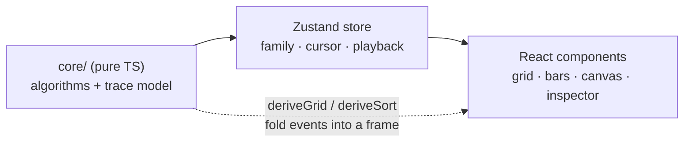

<div align="center">

# Algoscope

**An instrument for watching algorithms and machine-learning models think.**

Algoscope turns an algorithm run into a recording you can replay. Step through it, scrub the timeline, and read the live state, metrics, and pseudocode beside the visualization. Pathfinding, sorting, and a small machine-learning corner all share the same controls.

<br>

[](https://mahan-imanian.github.io/ML-Algorithm-Visualizer/)
[](LICENSE)


<br>

[**Live demo**](https://mahan-imanian.github.io/ML-Algorithm-Visualizer/) · [Architecture](#architecture) · [Quick start](#quick-start) · [Scripts](#scripts) · [Testing](#testing)

</div>

<!-- Add a screenshot or GIF of a run here for the best first impression:
<p align="center"></p> -->

---

## Contents

- [Why Algoscope](#why-algoscope)
- [Highlights](#highlights)
- [Algorithms](#algorithms)
- [Architecture](#architecture)
- [Quick start](#quick-start)
- [Scripts](#scripts)
- [Project structure](#project-structure)
- [Testing](#testing)
- [Deployment](#deployment)
- [Contributing](#contributing)
- [License](#license)

## Why Algoscope

Most visualizers play one animation and leave you to trust it. Algoscope treats a run as data instead. Each algorithm emits a flat list of events (a cell visited, a node pushed to the frontier, a comparison, a swap, a centroid moving), and the entire interface is a pure function of a cursor into that list. Stepping forward, stepping back, scrubbing, and exporting a session all reduce to the same operation: move or serialize the cursor.

That design is also what keeps the codebase honest. The algorithms live in a framework-free core with no DOM or React dependencies, so they can be unit-tested in isolation, and the UI never has a chance to disagree with the trace it is rendering.

## Highlights

- **Replayable traces** with step, scrub, and adjustable playback speed
- **Live inspector** showing current state and metrics, the raw event log, and pseudocode with the active line highlighted
- **Editable terrain**: draw walls and weighted cells, or generate fresh datasets for sorting and learning
- **Command palette** (`⌘K` / `Ctrl K`) and full keyboard control
- **JSON export** of any run
- **Accessible by construction**: WCAG AA contrast, a high-visibility focus ring, and `prefers-reduced-motion` support
- **A considered visual system**: layered surfaces, depth, and elevation rather than flat darkness

## Algorithms

| Family | Algorithms |
|--------|------------|
| Pathfinding | BFS, DFS, Dijkstra, A\* |
| Sorting | Insertion, Selection, Bubble, Quicksort |
| Learning | k-means clustering, Gradient descent |

## Architecture

A framework-free engine sits under the React interface. The engine owns the algorithms and the trace model; the UI is a thin, replaceable rendering layer driven by a single store.



| Layer | Location | Responsibility |
|-------|----------|----------------|
| Core engine | `src/core` | Algorithms, the event-trace model, and `derive*` fold functions. Framework-free, fully unit-tested. |
| State | `src/store` | A Zustand store holding the active family, grid, dataset, trace, and playback cursor. |
| UI | `src/components` | React and Tailwind components with shadcn/ui primitives, rendering a frame derived from the cursor. |

**Stack:** React 18, TypeScript (strict), Vite, Tailwind CSS, shadcn/ui (Radix), Zustand, Vitest, Testing Library, ESLint, Prettier.

## Quick start

```bash
git clone https://github.com/Mahan-Imanian/ML-Algorithm-Visualizer.git
cd ML-Algorithm-Visualizer
npm install
npm run dev
```

Vite prints a local URL. Open it and press `Run`, or hit `⌘K` for the command palette. A hosted build lives at the [live demo](https://mahan-imanian.github.io/ML-Algorithm-Visualizer/).

### Keyboard shortcuts

| Key | Action |
|-----|--------|
| `Space` | Run / pause |
| `→` / `←` | Step forward / back |
| `⌘K` / `Ctrl K` | Command palette |
| `W` / `G` / `E` | Wall / weight / erase tool |

## Scripts

| Command | Description |
|---------|-------------|
| `npm run dev` | Start the Vite dev server |
| `npm run build` | Type-check and build for production |
| `npm run preview` | Preview the production build |
| `npm test` | Run the Vitest suite |
| `npm run lint` | Run ESLint |
| `npm run format` | Format with Prettier |

## Project structure

```text
src/
├── core/                 # Framework-free engine
│   ├── pathfinding.ts    # BFS, DFS, Dijkstra, A* + deriveGrid
│   ├── sorting.ts        # insertion, selection, bubble, quick + deriveSort
│   ├── learning.ts       # k-means, gradient descent
│   ├── types.ts          # event and frame types
│   ├── index.ts          # algorithm registry + pseudocode
│   └── __tests__/        # engine unit tests
├── store/                # Zustand trace store
├── components/           # UI, including ui/ (shadcn primitives) and stages/
├── App.tsx               # Layout, playback loop, keyboard shortcuts
└── index.css             # Design tokens (WCAG-checked OKLCH palette)
```

## Testing

```bash
npm test
```

The suite covers two layers:

- **Engine correctness:** pathfinders return shortest paths on open grids, every sort actually sorts, k-means inertia never increases, and gradient-descent loss is monotonically non-increasing.
- **UI smoke tests:** the app renders, `Run` records a trace, and switching families updates the active algorithm.

## Deployment

The production build is published to GitHub Pages from the `docs/` folder on `main`. Rebuild it with:

```bash
npm run build -- --outDir docs
```

The Vite `base` is set to the repository path so assets resolve correctly under the project subpath.

## Contributing

Issues and pull requests are welcome. A few conventions keep the codebase coherent:

- Keep new algorithms inside `src/core` and framework-free, and add a test alongside them.
- Register an algorithm's metadata and pseudocode in `src/core/index.ts` so the inspector can display it.
- Run `npm run lint` and `npm test` before opening a pull request.

## License

[MIT](LICENSE) © Mahan Imanian
