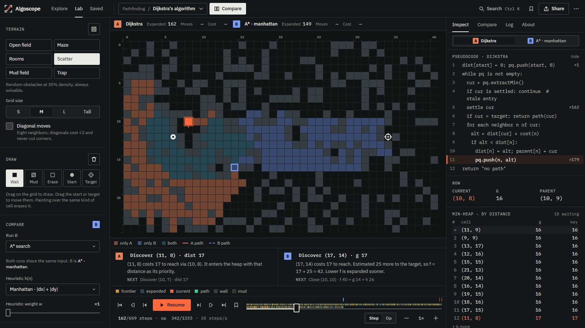

# Algoscope

**An algorithm lab that records every operation an algorithm performs and plays it back beside the data structure, the pseudocode line and the reason for each step.**

[Open the lab](https://mahan-imanian.github.io/ML-Algorithm-Visualizer/) · [Changelog](CHANGELOG.md) · [Audit and scorecard](docs/AUDIT.md)



## Key capabilities

- **18 algorithms in five families**, each recorded as a typed event trace you can scrub, step and reverse.
- **The data structure is always visible:** BFS queue, DFS stack, Dijkstra's min-heap (with stale entries), A\*'s open set with g, h and f, quicksort's call stack, merge sort's buffer, Kruskal's union-find fragments, k-means clusters, the gradient vector.
- **Every step is explained with real values**, and the next step is previewed: "A cheaper route to (9, 8) through (10, 8): dist 7 → 6."
- **Comparison with a verdict.** Two algorithms, or two settings of one, run on the same input. The grid overlays both runs, and the Compare panel states the difference, for example "Both find a path of cost 46. A\* expands 55% fewer cells", and points to the exact cell where the two expansion orders first diverge.
- **Presentation mode** for lectures: full screen, large type, toggleable code, state, explanation and metrics.
- **Experiments are links.** Input, seed, settings and optionally the current step are encoded in the URL. JSON export and import and a local library use the same format.

## Why it exists

Most visualizers animate the output of an algorithm and stop there. That hides the part students actually get wrong: _why_ this cell, this pivot or this edge comes next. Algoscope treats a run as a recording. It keeps the structure the algorithm decides from on screen at every step, and it lets you put two algorithms side by side on identical input so the difference is measurable instead of anecdotal.

## Core experience

1. **Pick a question**, not an algorithm. Explore offers 14 prepared experiments: _Why does greedy search walk into the trap? Can insertion sort beat merge sort? What happens when the learning rate is too high?_
2. **Run it.** The input is already prepared and the run already recorded, so nothing starts empty.
3. **Step through.** Move one logical step (an expansion, a pass, an iteration) or one operation at a time. The pseudocode line, the data structure and the caption move together.
4. **Change one thing** (a wall, the pivot rule, the heuristic, the learning rate) and the run is recorded again instantly.
5. **Compare and share** the exact experiment with a link.


## Supported algorithms

| Family         | Algorithms                                                                                                                                               | What you see                                                          |
| -------------- | -------------------------------------------------------------------------------------------------------------------------------------------------------- | --------------------------------------------------------------------- |
| Pathfinding    | BFS, DFS, Dijkstra (binary heap, lazy deletion), A\* (Manhattan, Euclidean, octile or zero heuristic, weight 1–5), greedy best-first; diagonals optional | Queue, stack or heap with priorities; frontier, expansion order, path |
| Sorting        | Insertion, selection, bubble (early exit), quicksort (last, median-of-three or seeded random pivot), merge, heap                                         | Pointers, active range, call stack, merge buffer, heap boundary       |
| Searching      | Linear, binary, jump                                                                                                                                     | lo / hi / probe, candidates left, probes against a linear scan        |
| Spanning trees | Prim, Kruskal (union-find)                                                                                                                               | Candidate heap or sorted edges, fragments, rejected edges             |
| Learning       | k-means (k-means++, random, deliberately bad or hand-placed centroids), gradient descent on linear regression (learning rate, momentum, start)           | Voronoi regions and inertia; loss surface, descent path, gradient     |

Each algorithm has an About panel with complexity, guarantees, the state it keeps, common mistakes and when to use it.

| Quicksort, mid-partition                                                  | Kruskal, rejecting a cycle                                                         | k-means, converged                                                        |
| ------------------------------------------------------------------------- | ---------------------------------------------------------------------------------- | ------------------------------------------------------------------------- |
|  |  |  |

## Interactive capabilities

- **Grid editor:** draw walls and mud with mouse, touch or keyboard; drag the start and target; generate mazes, rooms, scatter, mud fields or a heuristic trap; four grid sizes.
- **Graph editor:** move nodes (weights follow distance), connect or disconnect nodes, add and delete nodes. A disconnected graph is reported as a spanning forest.
- **Array input:** five orders (random, nearly sorted, reversed, sorted, few unique) or your own values.
- **Learning input:** datasets, k, initialisation, learning rate, momentum, start point, step budget.
- **Timeline:** an activity tape coloured by event type, milestones such as _target discovered_ or _first partition done_, your own bookmarks (`B`), six speeds, step or single-operation granularity.
- **Command palette** (`Ctrl K` or `/`): every algorithm, experiment and action. Typing `BFS` finds breadth-first search first; a test keeps it that way.

| Command palette                                         | Phone, 390 px                                                |
| ------------------------------------------------------- | ------------------------------------------------------------ |
|  |  |

## Demonstration capabilities

Press `P` for presentation mode. The visualization takes the screen, type gets larger, and `C`, `S`, `E` and `M` toggle the code, state, explanation and metrics. `Esc` leaves. The layout is fixed, so nothing moves while you talk, and every view is a link you can put on a slide.


## Architecture

```text
src/core/        Framework-free engine: no React, no DOM
  grid/ sort/ search/ graph/ learn/   algorithms emit typed events; machines fold events into state
  player.ts      keyframe cache: any step of a 40k-event trace in well under a millisecond
  info.ts        names, complexity, depth notes and pseudocode with named line anchors
  experiment.ts  experiment → runs, metrics, comparison verdicts
  share.ts       versioned, validated link and file format
src/store/       Zustand: lab (experiment, runs, cursors, playback), library, settings, UI
src/ui/          React: Explore, Lab (Setup / Stage / Inspector / Transport), Present, palette, dialogs
  clock.ts       the two clocks: live cursor for canvases, 20 Hz presented cursor for panels
  perf.ts        frame, draw and commit counters behind the frame monitor (H)
extension/       Manifest V3 build of the same app
```

**Simulation and presentation are separate.** The recorded trace is the simulation. Canvases subscribe to the live cursor and draw imperatively in `requestAnimationFrame`. Motion is time-based (`1 − e^(−dt/τ)`), so it looks the same at 60, 120 or 144 Hz. Text panels follow a presented cursor that is throttled to 20 Hz while playing and immediate when paused. React never renders per frame.

**The layout is a contract.** The stage sits in fixed grid tracks (`minmax(0,1fr) 104px 28px 88px`) with `contain: strict`. Captions are fixed-height and clamped, headers are single-line with tabular, fixed-width readouts, and scrolling panes reserve their scrollbar gutter. No amount or length of text can resize the visualization.

**Pseudocode can't drift.** Every event names the pseudocode line it belongs to. A test runs every algorithm and scenario and checks that each line exists and describes the event.

## Performance

Measured on the production build in Chrome on a 60 Hz display with the frame monitor (`H`). It reports rAF intervals, per-surface draw time and per-component commit rates; it does not estimate or invent FPS.

| Workload                                                                       | Median frame | p95             | Worst          | Dropped | Canvas draw (avg / max)                     |
| ------------------------------------------------------------------------------ | ------------ | --------------- | -------------- | ------- | ------------------------------------------- |
| Largest weighted grid (61×37), BFS vs Dijkstra overlaid, Log open, 480 steps/s | 16.7 ms      | 17.0 ms         | 17.2 ms        | 0.0 %   | 0.54 / 1.40 ms                              |
| Small, medium and large grids; sort, k-means and gradient compares, 8×         | 16.7 ms      | ≤ 17.4 ms (p99) | 33.2 ms (once) | 0–0.6 % | grid 0.12–0.27 / 0.8 ms; bars 0.32 / 4.4 ms |

- Text panels commit about 9–16 times per second during playback, under the 20 Hz cap, regardless of speed.
- JS heap is 48 MB on the largest comparison.
- Initial JS is 459 KB (150 KB gzip). The lab chunk loads separately (104 KB, 35 KB gzip). There are no third-party requests.
- For 120 and 144 Hz, the per-frame budgets are 8.3 ms and 6.9 ms. The worst canvas draw above (1.4 ms) is well inside both. This was not measured on a high-refresh display.
- Version 3.0.0 had a p95 of 233 ms on the same large comparison and resized the stage whenever the caption wrapped. [docs/AUDIT.md](docs/AUDIT.md) has the before-and-after.

## Accessibility

- Lighthouse accessibility is 100 on Explore and the Lab, in both themes, on desktop and mobile.
- Every control is keyboard reachable with visible focus. The grid is an application region with arrow-key navigation, `Space` to apply a tool, and `S` / `T` to place the start and target.
- Live regions announce the current step when paused and stay quiet during playback.
- Motion respects the reduced-motion setting, with an override in Settings. Single-key shortcuts can be turned off.
- Text meets 4.5:1 contrast in both themes, including the orange actions.
- Not yet done: a session with a real screen reader (NVDA or VoiceOver).

## Getting started

Open the [hosted lab](https://mahan-imanian.github.io/ML-Algorithm-Visualizer/), or run it locally:

```bash
npm install
npm run dev
```

Then open http://localhost:5173/ML-Algorithm-Visualizer/. Node 20 or newer.

## Development

```bash
npm run lint
npm run typecheck
npm run build        # GitHub Pages build in dist/
npm run build:ext    # Chrome extension in dist-extension/
npm run images       # regenerate icons and og.png from real engine output
```

Keyboard: `Space` play/pause · `←` `→` step · `⇧←` `⇧→` one operation · `[` `]` milestones · `B` bookmark · `Home` `End` · `−` `=` speed · `G` step size · `N` new input · `M` maze · `C` compare · `1`–`5` grid tools · `P` present · `H` frame monitor · `Ctrl K` palette · `?` all shortcuts.

## Testing

```bash
npm test
```

100 tests cover:

- correctness of every algorithm family, plus graph editing and disconnected graphs
- pseudocode synchronisation and scenario claims
- random access in the player
- share and file round-trips, including damaged links
- shortcut conflicts, and command search against the real command list (`BFS`, `bfs`, `A*`, `astar`, …)
- end-of-run captions, layout and routing
- UI journeys: first visit, tour, stepping with the code highlight, compare verdict, shared links, the palette end to end, presentation mode and bookmarks

## Deployment

Pushing to `main` runs two workflows. **CI** runs lint, typecheck, tests, the web build and the extension build. **Deploy** publishes `dist/` to GitHub Pages. The extension is Manifest V3 with a single `sidePanel` permission, no content scripts, no host permissions and a strict CSP; load `dist-extension/` at `chrome://extensions` → _Load unpacked_.

## Roadmap

- A data-structures family (binary heap, BST, hash table) and Bellman-Ford and topological sort.
- Browser end-to-end tests in CI.
- A screen-reader pass with NVDA and VoiceOver.
- Measurement on real 120 and 144 Hz displays.
- Sessions with students and teachers to check whether the explanations teach what they claim.

## Contributing

Issues and pull requests are welcome. To add an algorithm:

1. Emit typed events from `src/core/<family>/` with an `op` that names a pseudocode line.
2. Add its entry, pseudocode and depth notes in `src/core/info.ts`.
3. Run `npm test`: the pseudocode test fails if any event points at a line that doesn't exist.

Keep `npm run lint`, `npm run typecheck` and `npm test` green.

## License

[MIT](LICENSE) © Mahan Imanian
