<picture>
  <source media="(prefers-color-scheme: dark)" srcset=".github/assets/cover-dark.png">
  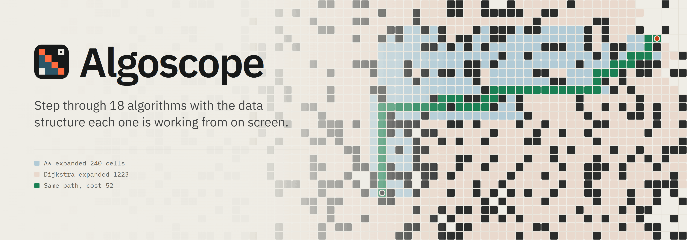
</picture>

<p align="center">
  <a href="https://github.com/Mahan-Imanian/stride/actions/workflows/ci.yml"></a>
  <a href="https://github.com/Mahan-Imanian/stride/actions/workflows/deploy.yml"></a>
  <a href="LICENSE"></a>
  <a href="https://mahan-imanian.github.io/stride/"></a>
</p>

<p align="center">
  <a href="https://mahan-imanian.github.io/stride/"><b>Open the lab</b></a> ·
  <a href="#quick-start">Quick start</a> ·
  <a href="#what-you-can-do">Features</a> ·
  <a href="#algorithms">Algorithms</a> ·
  <a href="#how-it-works">How it works</a> ·
  <a href="docs/internals.md">Internals</a>
</p>

<br>

<a href="https://mahan-imanian.github.io/stride/">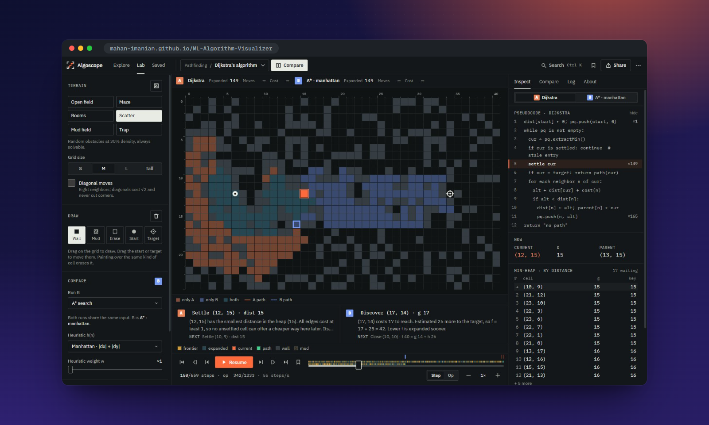</a>

Stride records every operation of a run and plays it back next to the data structure the algorithm reads from, such as the BFS queue, Dijkstra's heap or quicksort's call stack. Each step has a caption with the actual values, and two algorithms can run on the same input so their counts can be compared directly.

## What you can do

### Compare two algorithms on the same input

Run two algorithms, or two settings of one, on the same grid. The overlay shows both expansions at once, and the Compare panel gives the verdict in plain numbers ("both find a path of cost 46; A\* expands 55% fewer cells") and points to the first cell where the two orders diverge.

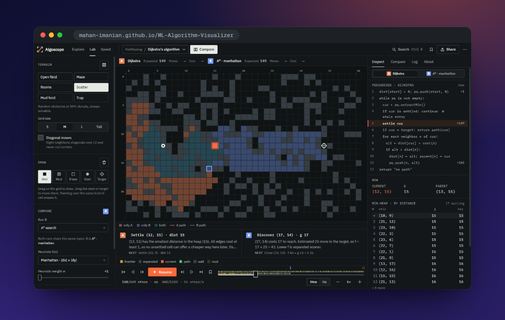


### See the structure the algorithm is deciding from

The BFS queue, DFS stack, Dijkstra's min-heap (stale entries included), A\*'s open set with g, h and f, quicksort's call stack, merge sort's buffer and Kruskal's union-find fragments are always visible. Each step's caption uses real values, for example "a cheaper route to (9, 8) through (10, 8): dist 7 → 6", and the pseudocode line moves with it.

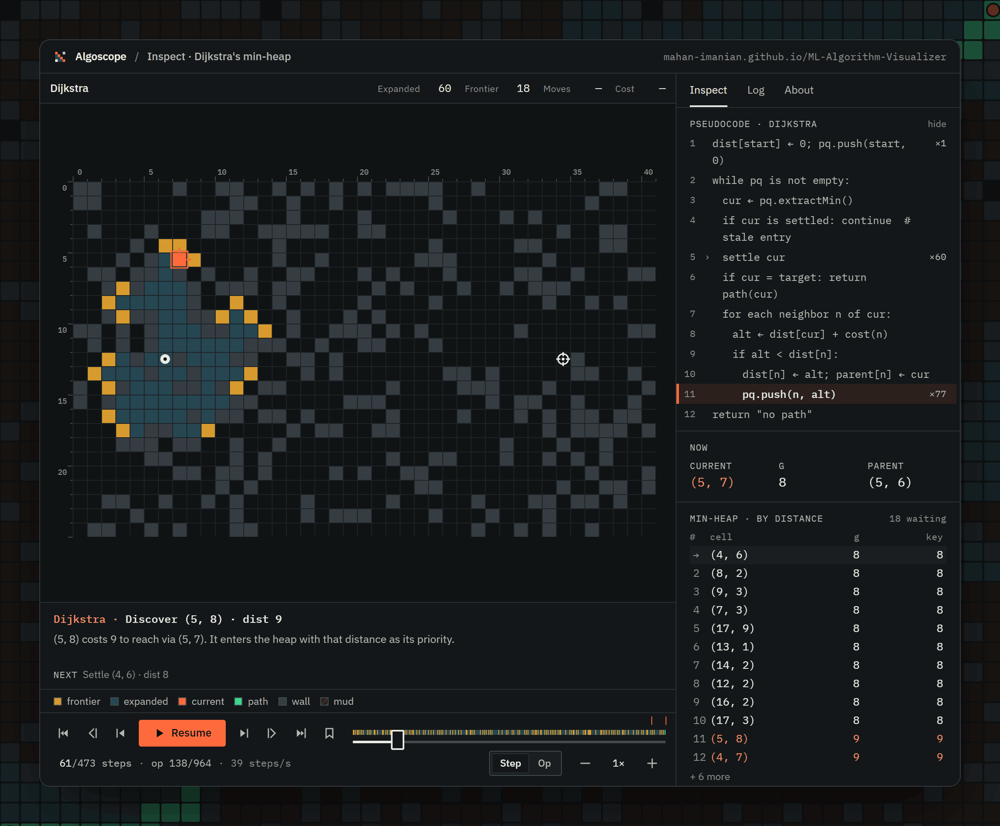

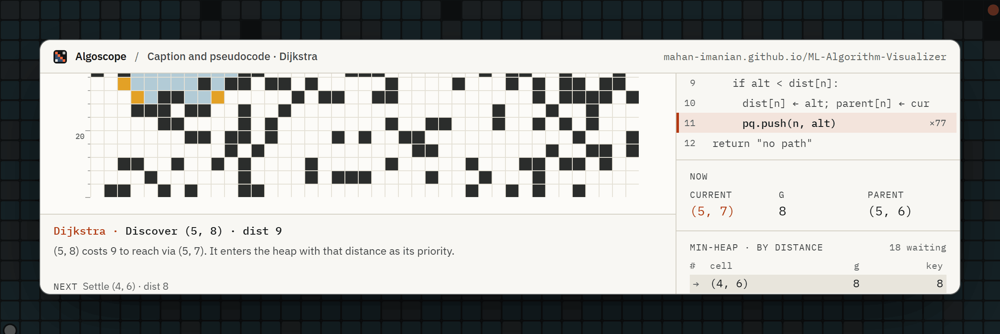

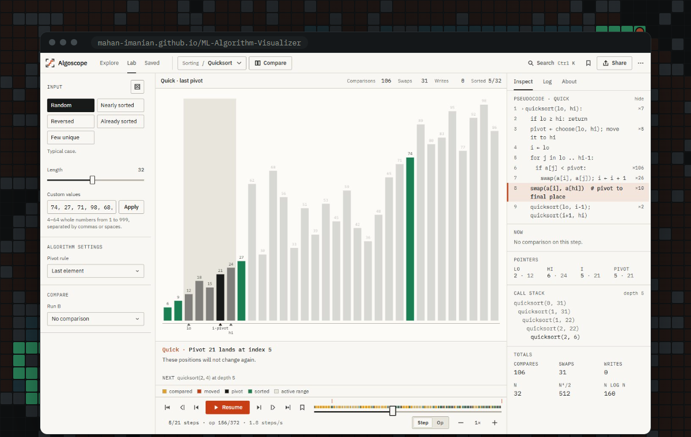

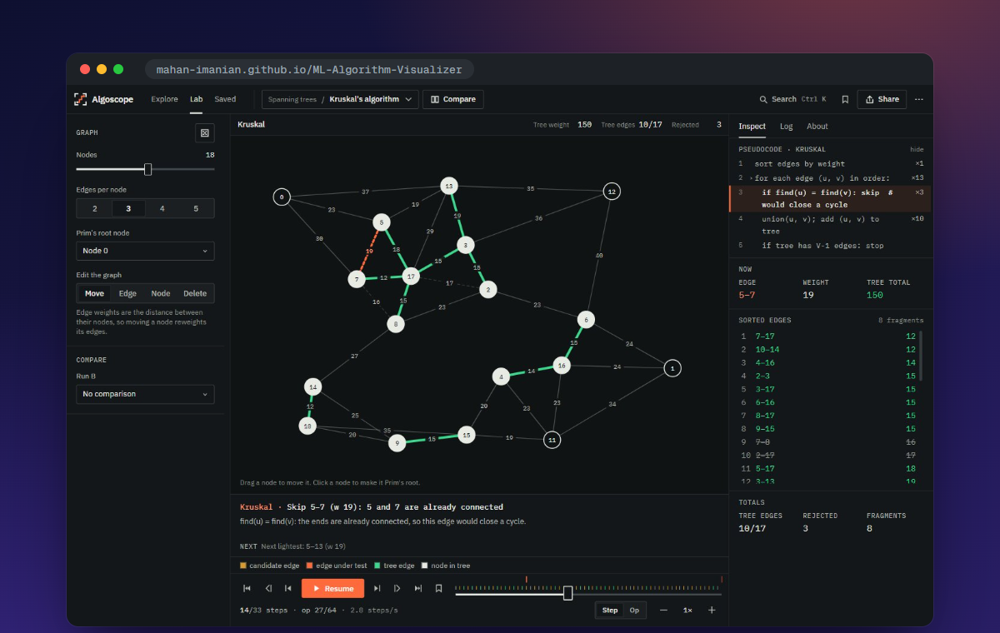

### Prepared experiments

Explore lists 14 prepared experiments, each with a question such as _Why does breadth-first search always find the fewest moves?_ or _On nearly sorted data, can a quadratic sort beat merge sort?_ The input is built and the run is recorded when you open one. Change a wall, the pivot rule, the heuristic or the learning rate and the run is recorded again.

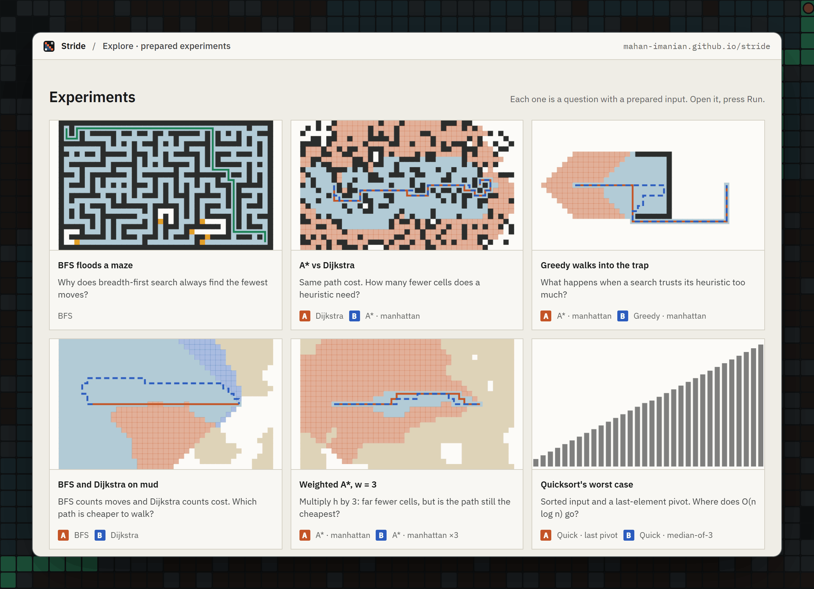

In _Bad starting centroids_, k-means++ settles at inertia 1.657 after 2 iterations, while centroids started in a corner settle at 7.718 after 4, with one cluster left empty.

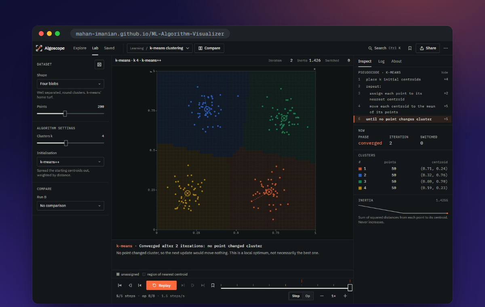

### Presentation mode and share links

Press <kbd>P</kbd> for presentation mode: full screen, large type, and toggles for code, state, explanation and metrics. Every experiment is a link: input, seed, settings and optionally the current step are encoded in the URL, and JSON export uses the same format.

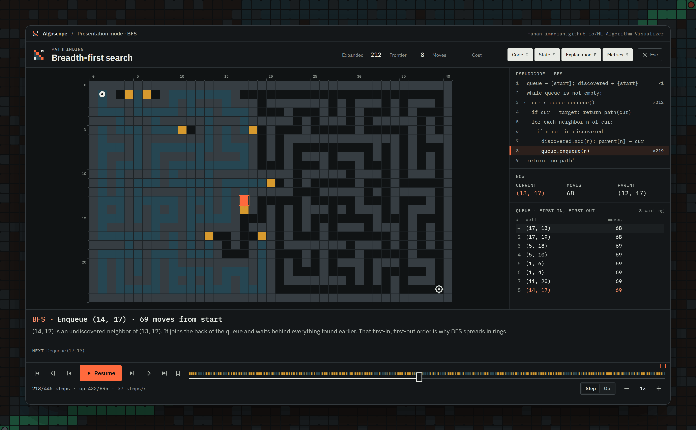

## Quick start

Open the [hosted lab](https://mahan-imanian.github.io/stride/), or run it locally with Node 20 or newer:

```bash
git clone https://github.com/Mahan-Imanian/stride.git
cd stride
npm install
npm run dev
```

Then open http://localhost:5173/stride/.

## Algorithms

| Family         | Algorithms                                                                                                                                               | What you see                                                          |
| -------------- | -------------------------------------------------------------------------------------------------------------------------------------------------------- | --------------------------------------------------------------------- |
| Pathfinding    | BFS, DFS, Dijkstra (binary heap, lazy deletion), A\* (Manhattan, Euclidean, octile or zero heuristic, weight 1–5), greedy best-first; diagonals optional | Queue, stack or heap with priorities; frontier, expansion order, path |
| Sorting        | Insertion, selection, bubble (early exit), quicksort (last, median-of-three or seeded random pivot), merge, heap                                         | Pointers, active range, call stack, merge buffer, heap boundary       |
| Searching      | Linear, binary, jump                                                                                                                                     | lo / hi / probe, candidates left, probes against a linear scan        |
| Spanning trees | Prim, Kruskal (union-find)                                                                                                                               | Candidate heap or sorted edges, fragments, rejected edges             |
| Learning       | k-means (k-means++, random, deliberately bad or hand-placed centroids), gradient descent on linear regression (learning rate, momentum, start)           | Voronoi regions and inertia; loss surface, descent path, gradient     |

Each algorithm has an About panel with complexity, guarantees, the state it keeps, common mistakes and when to use it.

## How it works

Each run is recorded in full before it is played. Each algorithm (`runGrid`, `runSort` and so on in `src/core/`) writes a typed event trace through a `TraceBuilder`, and every event names the pseudocode line it belongs to. A `Player` folds those events into state with the family's machine and caches keyframes, so the scrubber can jump to any step without replaying from the start.

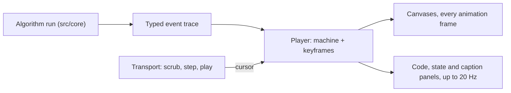
```mermaid
flowchart LR
  A["Algorithm run (src/core)"] --> T[Typed event trace]
  T --> P["Player: machine + keyframes"]
  S["Transport: scrub, step, play"] -->|cursor| P
  P --> C["Canvases, every animation frame"]
  P --> X["Code, state and caption panels, up to 20 Hz"]
```

`src/core/` has no React and no DOM. Canvases draw from the live cursor in `requestAnimationFrame`; text panels follow a cursor throttled to 20 Hz during playback, so React never renders per frame. Source layout, rendering details, how the figures in this README were measured, the tuning constants, the keyboard map and how to add an algorithm are in [docs/internals.md](docs/internals.md).

### Design decisions

- **Record first, then play back.** Each run is computed to completion before playback starts, which is what makes backward scrubbing, jumping to any step, aligning two runs on one timeline and testing every event possible. The cost is that input size is capped (61×37 grids, 64 values to sort, 400 points) so that recording stays fast, every input edit records the run again, and each family needs a state machine that replays its events next to the algorithm itself.
- **A core without React or the DOM.** Algorithms, traces, the player, scenarios and the share format live in `src/core/`. Tests run them in Node, and the image and performance scripts bundle them with esbuild. The price is a translation layer (`explain.ts`, the state panels) between events and what the UI shows.
- **Canvas for the visualization, React for text, panels at 20 Hz.** A 61×37 grid has 2,257 cells, and a comparison shows two of them. Drawing them on a canvas usually takes a few milliseconds per frame ([measurements](docs/internals.md#measurements)); re-rendering the React stage on every cursor change was the main cause of dropped frames in 3.0.0. Text panels are capped at 20 updates a second during playback, since text changing faster than that cannot be read anyway, so they can lag the canvas by up to 50 ms while playing and catch up as soon as playback pauses. 20 Hz is a round figure, not a tuned one. Canvas content is invisible to screen readers, so the grid has its own keyboard cursor and live region, and the other views rely on the caption and state panels.
- **No backend.** The site is static on GitHub Pages and the extension is the same bundle. A share link carries the whole experiment (base64 JSON with run-length-encoded grid cells), so sharing needs no server or account. The trade-offs are long links (a 61×37 maze encodes to about 5 KB), saved experiments that stay in one browser, no way to revoke a link once sent, and no usage data. Links stay valid only as long as format version 3 is decoded the same way; `src/core/__tests__/share.test.ts` round-trips every prepared experiment and checks minimal, hand-edited and malformed links.

## Chrome extension

The same app also builds as a Manifest V3 extension (Chrome 116 or newer):

```bash
npm run build:ext
```

Open `chrome://extensions`, turn on Developer mode, choose **Load unpacked** and select `dist-extension/`. The toolbar button opens the lab in a tab, and it is also available in Chrome's side panel.

| Permission  | Why                                                                |
| ----------- | ------------------------------------------------------------------ |
| `sidePanel` | Registers the lab as a side panel page. Nothing else is requested. |

No content scripts, no host permissions and a strict CSP (`script-src 'self'`). The app contacts no hosts: fonts are bundled, and saved experiments and settings stay in the browser's local storage.

## Development

| Command              | What it does                                                                                     |
| -------------------- | ------------------------------------------------------------------------------------------------ |
| `npm test`           | Vitest: algorithms against reference implementations, player, share links, contrast, UI journeys |
| `npm run lint`       | ESLint                                                                                           |
| `npm run typecheck`  | `tsc --noEmit`                                                                                   |
| `npm run build`      | Type-checks and builds the GitHub Pages site into `dist/`                                        |
| `npm run build:ext`  | Builds the extension into `dist-extension/`                                                      |
| `npm run images`     | Regenerates the icons and `og.png` from real engine output                                       |
| `npm run bench`      | Times recording a run and seeking, for the largest input of each family                          |
| `npm run perf`       | Plays every algorithm in headless Chrome and reports frame times (needs `CHROME_PATH`)           |
| `npm run lighthouse` | Runs Lighthouse 12.8.2 on Explore and the Lab, mobile and desktop                                |

CI runs lint, typecheck, tests and both builds on every push and pull request to `main`. Pushing to `main` also deploys `dist/` to GitHub Pages. The engine figures quoted above (path costs, expansion counts, inertia, the number of algorithms and experiments) are recomputed by `src/core/__tests__/readme.test.ts`. `bench`, `perf` and `lighthouse` are not part of CI; [docs/internals.md](docs/internals.md#measurements) explains how to run them and lists the last results with their environment.

## Limits

- Accessibility has been checked with Lighthouse (`npm run lighthouse`) and a token contrast test, not with a screen reader. Nobody has used the app with NVDA or VoiceOver yet.
- Frame times have only been measured in headless Chrome, which paces frames at 60 Hz. Nothing has been measured on a 120 or 144 Hz display or on a phone.
- On Lighthouse's simulated mobile connection, first paint waits for the 151 KB (gzip) main bundle, so the mobile performance score is lower than desktop.
- The UI tests run in jsdom. There are no browser end-to-end tests in CI.
- No data-structure family (BST, hash table) and no Bellman-Ford or topological sort yet.

See the [changelog](CHANGELOG.md) for what changed between versions.

Stride was called Algoscope until October 2026, and the repository was `ML-Algorithm-Visualizer`. GitHub redirects the old repository URL, but the old site at `/ML-Algorithm-Visualizer/` no longer exists. A link shared from it can still be opened by pasting it into **Import experiment** in the ⋯ menu, and files exported under the old name still import. Settings and saved experiments carry over because the origin is the same and the storage keys did not change.

## License

[MIT](LICENSE) © Mahan Imanian
