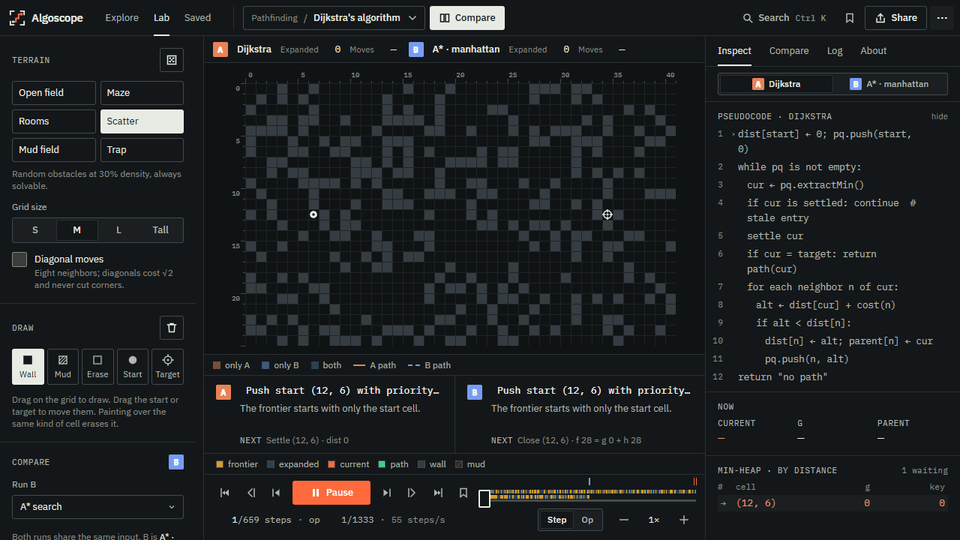
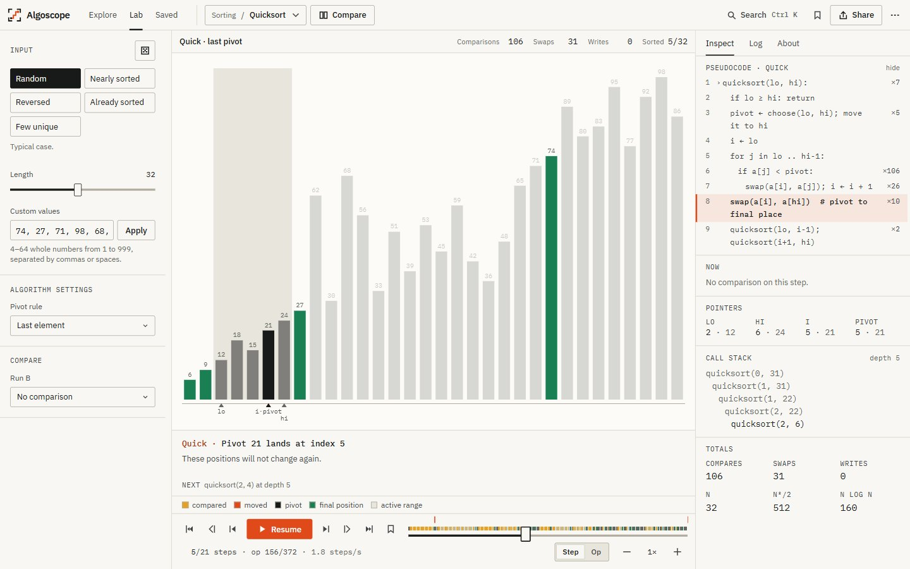
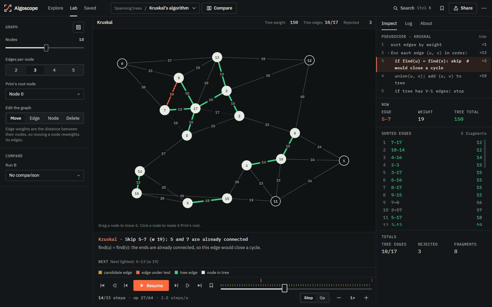
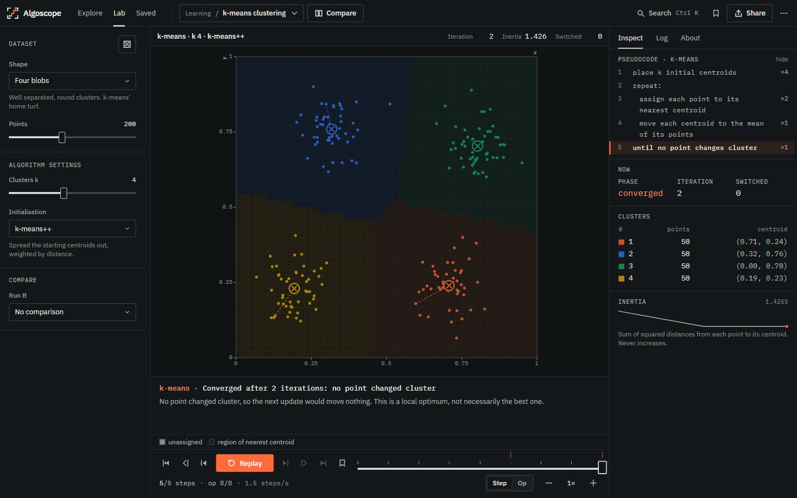
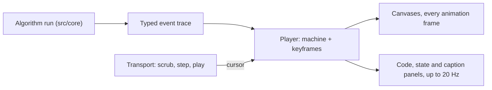

# Algoscope

An algorithm lab that records every step and plays it back next to the data structure.

[](https://github.com/Mahan-Imanian/ML-Algorithm-Visualizer/actions/workflows/ci.yml) [](https://github.com/Mahan-Imanian/ML-Algorithm-Visualizer/actions/workflows/deploy.yml) [](LICENSE) [](https://mahan-imanian.github.io/ML-Algorithm-Visualizer/)

[](https://mahan-imanian.github.io/ML-Algorithm-Visualizer/)

## Key capabilities

- **Step through 18 algorithms** in five families, forwards or backwards, one logical step or one operation at a time.
- **Watch the structure the algorithm decides from:** BFS queue, DFS stack, Dijkstra's min-heap with stale entries, A\*'s open set with g, h and f, quicksort's call stack, Kruskal's union-find fragments.
- **Read why each step happens.** The caption uses real values, for example "A cheaper route to (9, 8) through (10, 8): dist 7 → 6", and the pseudocode line moves with it.
- **Compare two runs on identical input**, two algorithms or two settings of one. The Compare panel states the difference (for example "A\* expands 55% fewer cells") and points to the first cell where the expansion orders diverge.
- **Start from 14 prepared experiments**, such as _Why does greedy search walk into the trap?_, or edit the grid, graph, array or dataset yourself.
- **Share an experiment as a link.** Input, seed, settings and optionally the current step live in the URL. Press `P` for a full-screen presentation mode.

## Quick start

Open the [hosted lab](https://mahan-imanian.github.io/ML-Algorithm-Visualizer/), or run it locally with Node 20 or newer:

```bash
npm install
npm run dev
```

Then open http://localhost:5173/ML-Algorithm-Visualizer/.

## Algorithms

| Family         | Algorithms                                                                                                                                               | What you see                                                          |
| -------------- | -------------------------------------------------------------------------------------------------------------------------------------------------------- | --------------------------------------------------------------------- |
| Pathfinding    | BFS, DFS, Dijkstra (binary heap, lazy deletion), A\* (Manhattan, Euclidean, octile or zero heuristic, weight 1–5), greedy best-first; diagonals optional | Queue, stack or heap with priorities; frontier, expansion order, path |
| Sorting        | Insertion, selection, bubble (early exit), quicksort (last, median-of-three or seeded random pivot), merge, heap                                         | Pointers, active range, call stack, merge buffer, heap boundary       |
| Searching      | Linear, binary, jump                                                                                                                                     | lo / hi / probe, candidates left, probes against a linear scan        |
| Spanning trees | Prim, Kruskal (union-find)                                                                                                                               | Candidate heap or sorted edges, fragments, rejected edges             |
| Learning       | k-means (k-means++, random, deliberately bad or hand-placed centroids), gradient descent on linear regression (learning rate, momentum, start)           | Voronoi regions and inertia; loss surface, descent path, gradient     |

Each algorithm has an About panel with complexity, guarantees, the state it keeps, common mistakes and when to use it. Despite the repository name, only the last two are machine learning.

| Quicksort, mid-partition                                                  | Kruskal, rejecting a cycle                                                         | k-means, converged                                                        |
| ------------------------------------------------------------------------- | ---------------------------------------------------------------------------------- | ------------------------------------------------------------------------- |
|  |  |  |

## How it works

A run is a recording, not an animation. Each algorithm (`runGrid`, `runSort` and so on in `src/core/`) writes a typed event trace through a `TraceBuilder`, and every event names the pseudocode line it belongs to. A `Player` folds those events into state with the family's machine and caches keyframes, so the scrubber can jump to any step without replaying from the start.


```mermaid
flowchart LR
  A["Algorithm run (src/core)"] --> T[Typed event trace]
  T --> P["Player: machine + keyframes"]
  S["Transport: scrub, step, play"] -->|cursor| P
  P --> C["Canvases, every animation frame"]
  P --> X["Code, state and caption panels, up to 20 Hz"]
```

`src/core/` has no React and no DOM. Canvases draw from the live cursor in `requestAnimationFrame`; text panels follow a cursor throttled to 20 Hz during playback, so React never renders per frame. Source layout, rendering details, performance and accessibility notes, the keyboard map and how to add an algorithm are in [docs/internals.md](docs/internals.md).

## Chrome extension

The same app also builds as a Manifest V3 extension (Chrome 116 or newer):

```bash
npm run build:ext
```

Open `chrome://extensions`, turn on Developer mode, choose **Load unpacked** and select `dist-extension/`. The toolbar button opens the lab in a tab, and it is also available in Chrome's side panel.

| Permission  | Why                                                                |
| ----------- | ------------------------------------------------------------------ |
| `sidePanel` | Registers the lab as a side panel page. Nothing else is requested. |

No content scripts, no host permissions and a strict CSP (`script-src 'self'`). The app contacts no hosts: fonts are bundled, and saved experiments and settings stay in the browser's local storage.

## Development

| Command             | What it does                                                             |
| ------------------- | ------------------------------------------------------------------------ |
| `npm test`          | Runs the 100 Vitest tests (algorithms, player, share links, UI journeys) |
| `npm run lint`      | ESLint                                                                   |
| `npm run typecheck` | `tsc --noEmit`                                                           |
| `npm run build`     | Type-checks and builds the GitHub Pages site into `dist/`                |
| `npm run build:ext` | Builds the extension into `dist-extension/`                              |
| `npm run images`    | Regenerates the icons and `og.png` from real engine output               |

CI runs lint, typecheck, tests and both builds on every push and pull request to `main`. Pushing to `main` also deploys `dist/` to GitHub Pages.

## Limits

- Lighthouse accessibility is 100 on Explore and the Lab (desktop and mobile, checked 2026-10-09), but there has been no session with a real screen reader yet (NVDA or VoiceOver).
- No browser end-to-end tests in CI; the UI tests run in jsdom.
- Smoothness was measured on a 60 Hz display only, not on 120 or 144 Hz.
- No data-structure family (BST, hash table) and no Bellman-Ford or topological sort yet.

See the [changelog](CHANGELOG.md) and the [audit and scorecard](docs/AUDIT.md) for what changed between versions and how it was checked.

## License

[MIT](LICENSE) © Mahan Imanian
