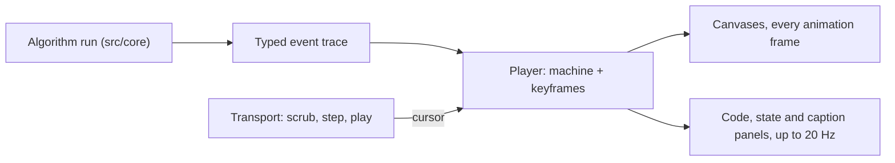

<picture>
  <source media="(prefers-color-scheme: dark)" srcset=".github/assets/cover-dark.png">
  
</picture>

<p align="center">
  <a href="https://github.com/Mahan-Imanian/ML-Algorithm-Visualizer/actions/workflows/ci.yml"></a>
  <a href="https://github.com/Mahan-Imanian/ML-Algorithm-Visualizer/actions/workflows/deploy.yml"></a>
  <a href="LICENSE"></a>
  <a href="https://mahan-imanian.github.io/ML-Algorithm-Visualizer/"></a>
</p>

<p align="center">
  <a href="https://mahan-imanian.github.io/ML-Algorithm-Visualizer/"><b>Open the lab</b></a> ·
  <a href="#quick-start">Quick start</a> ·
  <a href="#what-you-can-do">Features</a> ·
  <a href="#algorithms">Algorithms</a> ·
  <a href="#how-it-works">How it works</a> ·
  <a href="docs/internals.md">Internals</a>
</p>

<br>

<a href="https://mahan-imanian.github.io/ML-Algorithm-Visualizer/"></a>

Most visualizers animate the result of an algorithm and stop there. That hides the part people actually get wrong: why _this_ cell, _this_ pivot or _this_ edge comes next. Algoscope treats a run as a recording. The structure the algorithm decides from stays on screen at every step, every step is explained with real values, and two algorithms can run side by side on identical input so the difference is measured instead of guessed.

## What you can do

### Compare two algorithms on the same input

Run two algorithms, or two settings of one, on the same grid. The overlay shows both expansions at once, and the Compare panel gives the verdict in plain numbers ("both find a path of cost 46; A\* expands 55% fewer cells") and points to the first cell where the two orders diverge.


### See the structure the algorithm is deciding from

The BFS queue, DFS stack, Dijkstra's min-heap (stale entries included), A\*'s open set with g, h and f, quicksort's call stack, merge sort's buffer and Kruskal's union-find fragments are always visible. Each step's caption uses real values, for example "a cheaper route to (9, 8) through (10, 8): dist 7 → 6", and the pseudocode line moves with it.

<p align="center">
  
  
</p>

### Start from a question, not an algorithm

Explore opens with 14 prepared experiments such as _Why does greedy search walk into the trap?_ or _Can insertion sort beat merge sort?_ The input is already built and the run already recorded, so nothing starts empty. Change one thing (a wall, the pivot rule, the heuristic, the learning rate) and it records again instantly.

<p align="center">
  
  
</p>

### Teach with it, share it

Press <kbd>P</kbd> for presentation mode: full screen, large type, and toggles for code, state, explanation and metrics. Every experiment is a link: input, seed, settings and optionally the current step are encoded in the URL, and JSON export uses the same format.


## Quick start

Open the [hosted lab](https://mahan-imanian.github.io/ML-Algorithm-Visualizer/), or run it locally with Node 20 or newer:

```bash
git clone https://github.com/Mahan-Imanian/ML-Algorithm-Visualizer.git
cd ML-Algorithm-Visualizer
npm install
npm run dev
```

Then open http://localhost:5173/ML-Algorithm-Visualizer/.

## Algorithms

| Family         | Algorithms                                                                                                                                               | What you see                                                          |
| -------------- | -------------------------------------------------------------------------------------------------------------------------------------------------------- | --------------------------------------------------------------------- |
| Pathfinding    | BFS, DFS, Dijkstra (binary heap, lazy deletion), A\* (Manhattan, Euclidean, octile or zero heuristic, weight 1–5), greedy best-first; diagonals optional | Queue, stack or heap with priorities; frontier, expansion order, path |
| Sorting        | Insertion, selection, bubble (early exit), quicksort (last, median-of-three or seeded random pivot), merge, heap                                         | Pointers, active range, call stack, merge buffer, heap boundary       |
| Searching      | Linear, binary, jump                                                                                                                                     | lo / hi / probe, candidates left, probes against a linear scan        |
| Spanning trees | Prim, Kruskal (union-find)                                                                                                                               | Candidate heap or sorted edges, fragments, rejected edges             |
| Learning       | k-means (k-means++, random, deliberately bad or hand-placed centroids), gradient descent on linear regression (learning rate, momentum, start)           | Voronoi regions and inertia; loss surface, descent path, gradient     |

Each algorithm has an About panel with complexity, guarantees, the state it keeps, common mistakes and when to use it. Despite the repository name, only the last two are machine learning.

## How it works

A run is a recording, not an animation. Each algorithm (`runGrid`, `runSort` and so on in `src/core/`) writes a typed event trace through a `TraceBuilder`, and every event names the pseudocode line it belongs to. A `Player` folds those events into state with the family's machine and caches keyframes, so the scrubber can jump to any step without replaying from the start.


```mermaid
flowchart LR
  A["Algorithm run (src/core)"] --> T[Typed event trace]
  T --> P["Player: machine + keyframes"]
  S["Transport: scrub, step, play"] -->|cursor| P
  P --> C["Canvases, every animation frame"]
  P --> X["Code, state and caption panels, up to 20 Hz"]
```

`src/core/` has no React and no DOM. Canvases draw from the live cursor in `requestAnimationFrame`; text panels follow a cursor throttled to 20 Hz during playback, so React never renders per frame. Source layout, rendering details, performance and accessibility notes, the keyboard map and how to add an algorithm are in [docs/internals.md](docs/internals.md).

## Chrome extension

The same app also builds as a Manifest V3 extension (Chrome 116 or newer):

```bash
npm run build:ext
```

Open `chrome://extensions`, turn on Developer mode, choose **Load unpacked** and select `dist-extension/`. The toolbar button opens the lab in a tab, and it is also available in Chrome's side panel.

| Permission  | Why                                                                |
| ----------- | ------------------------------------------------------------------ |
| `sidePanel` | Registers the lab as a side panel page. Nothing else is requested. |

No content scripts, no host permissions and a strict CSP (`script-src 'self'`). The app contacts no hosts: fonts are bundled, and saved experiments and settings stay in the browser's local storage.

## Development

| Command             | What it does                                                             |
| ------------------- | ------------------------------------------------------------------------ |
| `npm test`          | Runs the 100 Vitest tests (algorithms, player, share links, UI journeys) |
| `npm run lint`      | ESLint                                                                   |
| `npm run typecheck` | `tsc --noEmit`                                                           |
| `npm run build`     | Type-checks and builds the GitHub Pages site into `dist/`                |
| `npm run build:ext` | Builds the extension into `dist-extension/`                              |
| `npm run images`    | Regenerates the icons and `og.png` from real engine output               |

CI runs lint, typecheck, tests and both builds on every push and pull request to `main`. Pushing to `main` also deploys `dist/` to GitHub Pages.

## Limits

- Lighthouse accessibility is 100 on Explore and the Lab (desktop and mobile, checked 2026-10-09), but there has been no session with a real screen reader yet.
- No browser end-to-end tests in CI; the UI tests run in jsdom.
- Smoothness was measured on a 60 Hz display only.
- No data-structure family (BST, hash table) and no Bellman-Ford or topological sort yet.

See the [changelog](CHANGELOG.md) and the [audit and scorecard](docs/AUDIT.md) for what changed between versions and how it was checked.

## License

[MIT](LICENSE) © Mahan Imanian
