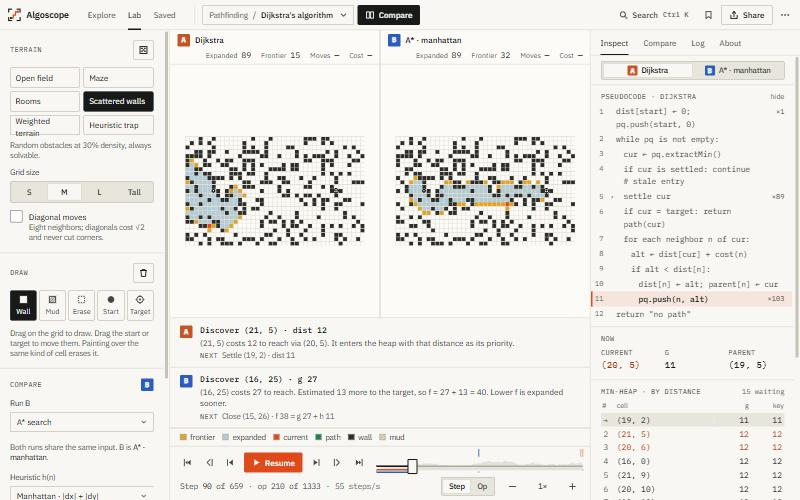
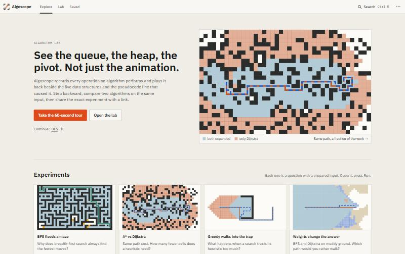
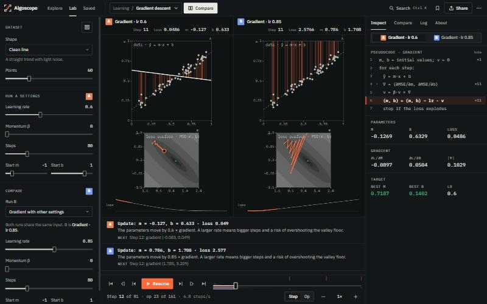
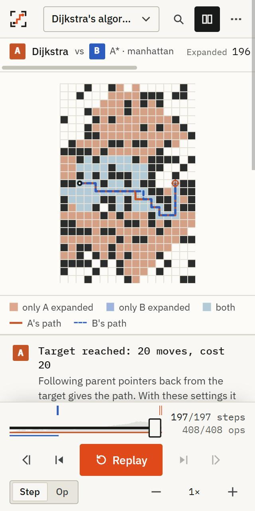

# Algoscope

**An algorithm lab. Step through an algorithm and see the queue, heap, pivot or gradient behind every decision.**

[Open the lab](https://mahan-imanian.github.io/ML-Algorithm-Visualizer/) · [Chrome extension](#chrome-extension) · [What changed in 3.0](CHANGELOG.md) · [Audit and resolution](docs/AUDIT.md)



Most visualizers play an animation and stop there. Algoscope records every operation an algorithm performs (each push, pop, comparison, swap and parameter update) and lets you move through that record in both directions. Beside the visualization you see:

- **the data structure the algorithm is working from**: the BFS queue, the DFS stack, Dijkstra's min-heap with stale entries, A\*'s open set with g, h and f, quicksort's call stack, merge sort's buffer, Kruskal's union-find fragments, k-means clusters, the gradient vector;
- **the pseudocode line that just ran**, with a count of how often each line has executed;
- **a plain-language reason for the step**, built from real values ("A cheaper route to (9, 8) through (10, 8): dist 7 → 6"), plus a preview of what happens next.

Run two algorithms, or the same algorithm with different settings, on the same input, and Algoscope tells you what differs: "Both find a path of cost 46. A\* expands 55% fewer cells (295 vs 658)."

## What you can do

|               |                                                                                                                                                                                                                                                                                                                                                            |
| ------------- | ---------------------------------------------------------------------------------------------------------------------------------------------------------------------------------------------------------------------------------------------------------------------------------------------------------------------------------------------------------- |
| **Explore**   | 14 prepared experiments, each a question: _Why does greedy search walk into the trap? Can insertion sort beat merge sort? What happens when the learning rate is too high?_                                                                                                                                                                                |
| **Configure** | Draw walls and mud by mouse, touch or keyboard; drag the start and target; generate mazes, rooms, scattered walls, weighted terrain or a heuristic trap. Choose array order (random, nearly sorted, reversed, sorted, few unique) or type your own values. Drag graph nodes. Pick datasets, k, initialisation, learning rate, momentum and starting point. |
| **Play**      | Step by logical step (an expansion, a pass, an iteration) or by single operation. Scrub, jump between checkpoints such as _target discovered_ or _first partition done_, and choose from six speeds. 1× finishes any run in about 12 seconds.                                                                                                              |
| **Compare**   | Side by side, or overlaid on one grid on phones, with a metric table and written verdict.                                                                                                                                                                                                                                                                  |
| **Keep**      | Save experiments in your browser, share an exact experiment (input, seed, settings, optionally the current step) as a link, and export or import JSON files.                                                                                                                                                                                               |

### Algorithms

| Family         | Algorithms                                                                                                                                                                                                                       |
| -------------- | -------------------------------------------------------------------------------------------------------------------------------------------------------------------------------------------------------------------------------- |
| Pathfinding    | BFS, DFS, Dijkstra (binary heap, lazy deletion), A\* (Manhattan, Euclidean, octile or zero heuristic; weight 1–5), greedy best-first; optional diagonal moves                                                                    |
| Sorting        | Insertion, selection, bubble (early exit), quicksort (last, median-of-three or seeded random pivot), merge, heap                                                                                                                 |
| Searching      | Linear, binary, jump                                                                                                                                                                                                             |
| Spanning trees | Prim, Kruskal (union-find)                                                                                                                                                                                                       |
| Learning       | k-means (k-means++, random, deliberately bad, or hand-placed starting centroids; separate assign and update steps); gradient descent on linear regression (learning rate, momentum, start point, loss surface with descent path) |

## Screens

| Paper theme                                   | Scope theme                                                                     | Phone                                                                        |
| --------------------------------------------- | ------------------------------------------------------------------------------- | ---------------------------------------------------------------------------- |
|  |  |  |

## Keyboard

`Space` play/pause · `←` `→` step · `⇧←` `⇧→` single operation · `[` `]` checkpoints · `Home` `End` · `−` `=` speed · `G` step size · `N` new input · `M` maze · `C` compare · `1`–`5` grid tools · `⌘K` or `/` command palette · `?` all shortcuts.

On the grid: Tab to it, move with the arrow keys, press `Space` to apply the current tool, `S` to place the start and `T` to place the target. Single-key shortcuts can be turned off in Settings.

## Chrome extension

```bash
npm run build:ext
```

This writes `dist-extension/`, which you load at `chrome://extensions` → _Load unpacked_. Clicking the toolbar icon opens the lab in a tab. It is also available in Chrome's side panel, where the phone layout applies.

- **Manifest V3.** The only permission is `sidePanel`, which shows no install warning.
- **No content scripts, no host permissions, no network access.** Fonts are bundled.
- **Strict CSP:** `script-src 'self'; object-src 'none'`. The pack script fails the build if an inline or remote script ever appears.
- **Share links point to the public site**, so recipients don't need the extension.

## Develop

```bash
npm install
npm run dev        # http://localhost:5173/ML-Algorithm-Visualizer/
npm test           # 92 tests: engines, pseudocode sync, share format, shortcuts, UI journeys
npm run lint
npm run typecheck
npm run build      # GitHub Pages build in dist/
npm run images     # regenerate icons and og.png from real engine output
```

Node 20 or newer.

### How it is built

```text
src/core/        Framework-free engine: no React, no DOM
  grid/ sort/ search/ graph/ learn/   algorithms emit typed event traces; machines fold events into state
  player.ts      keyframe cache: any step in a 40k-event trace in well under a millisecond
  info.ts        names, complexity, properties and pseudocode with named line anchors per algorithm
  experiment.ts  experiment config → runs, metrics, comparison verdicts
  share.ts       versioned, validated link and file format
  scenarios.ts   prepared experiments
src/store/       Zustand stores: lab (experiment, runs, cursors, playback), library, settings, UI
src/ui/          React: Explore, Lab (Setup / Stage / Inspector / Transport), palette, dialogs, tour
extension/       Manifest V3 files
scripts/         icon and social image generator, extension packer
```

Each event names the pseudocode line it belongs to. A test runs every algorithm on its default input and every scenario, then checks that each event's line exists and says what the event does. That way the highlighted line can't drift from the code.

## License

[MIT](LICENSE) © Mahan Imanian
