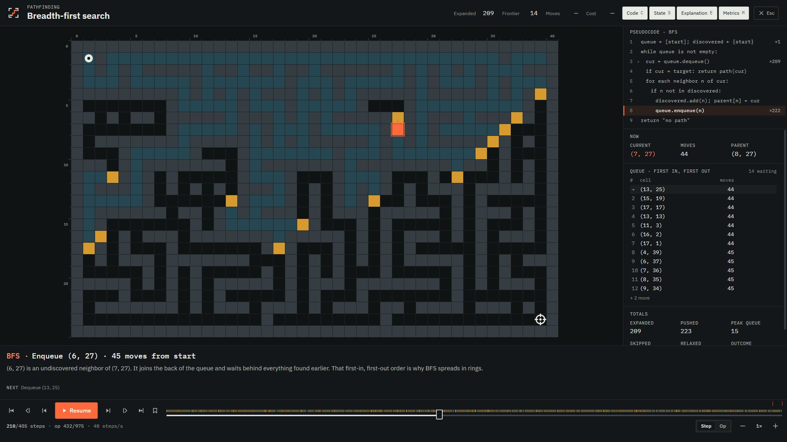
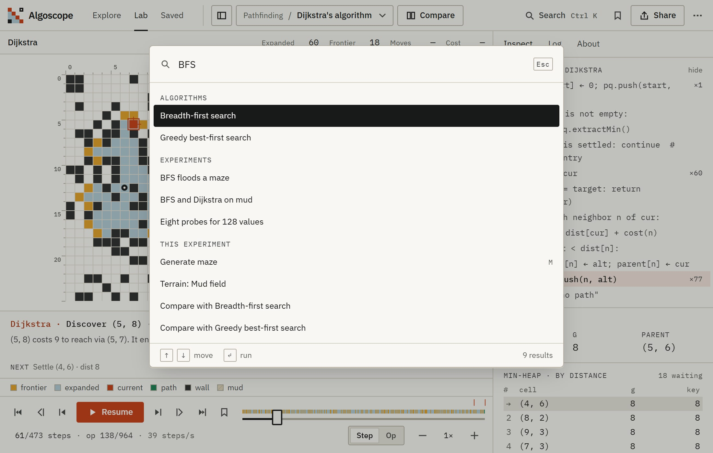
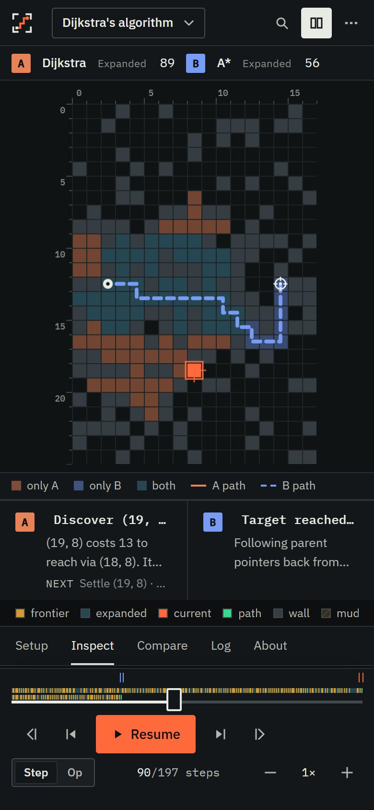

# Algoscope internals

Source layout, rendering model, measurements, tuning constants, accessibility notes, the keyboard map and how to add an algorithm. The design decisions behind the architecture are in the [README](../README.md#design-decisions); the audit history is in [AUDIT.md](AUDIT.md).

## Source layout

```text
src/core/        No React and no DOM
  grid/ sort/ search/ graph/ learn/   algorithms emit typed events; machines fold events into state
  trace.ts       TraceBuilder: events, step groups, milestones
  player.ts      keyframe cache for random access into a trace
  info.ts        names, complexity, depth notes and pseudocode with named line anchors
  scenarios.ts   the 14 prepared experiments
  experiment.ts  experiment → runs, metrics, comparison verdicts
  share.ts       versioned, validated link and file format
src/store/       Zustand: lab (experiment, runs, cursors, playback), library, settings, UI
src/ui/          React: Explore, Lab (Setup / Stage / Inspector / Transport), Present, palette, dialogs
  clock.ts       the two clocks: live cursor for canvases, 20 Hz presented cursor for panels
  perf.ts        frame, draw and render counters behind the frame monitor (H)
scripts/         images, extension packaging, performance and Lighthouse runs
extension/       Manifest V3 build of the same app
```

## Rendering model

**Simulation and presentation are separate.** The recorded trace is the simulation. Canvases subscribe to the live cursor and draw imperatively in `requestAnimationFrame`. Motion uses elapsed time (`1 − e^(−dt/τ)` for bars, a fixed duration for cells), so its speed does not depend on the frame rate; this has only been observed at 60 Hz. Text panels follow a presented cursor that is throttled to 20 Hz while playing and immediate when paused. React does not render once per frame.

**Fixed layout tracks.** The stage sits in fixed grid rows (`STAGE_ROWS_PX` in `src/lib/layout.ts`) with `contain: strict`. Captions have a fixed height and are clamped, headers are single-line with fixed-width tabular readouts, and scrolling panes reserve their scrollbar gutter, so text changes cannot resize the visualization. `npm run perf` checks this by recording each canvas's box on every frame.

**Pseudocode lines are checked.** Every event names the pseudocode line it belongs to. `src/core/__tests__/pseudocode.test.ts` runs every algorithm and scenario and checks that each named line exists and matches the event.

## Measurements

None of these run in CI. Each section gives the command, what it measures and the last result with its environment. The results came from a laptop that was running other work at the same time, so treat single worst-case values as noisy; medians and 95th percentiles were stable between runs except where noted.

### Recording and seeking: `npm run bench`

`src/core/__tests__/trace.bench.ts` uses `vitest bench` to time `runVariant` (trace plus keyframes) for the largest input of every family, and random seeks into the longest grid trace.

Last run on 2026-10-09, Node 24.12.0, Vitest 2.1.9, Windows 11, Intel Core i5-9300H, in Vitest's jsdom environment (the suite's default; the timed code does not touch the DOM). Times in milliseconds:

| Case (largest input of each family)           | Mean | p99  |
| --------------------------------------------- | ---- | ---- |
| Grid 61×37 mud, diagonal moves, Dijkstra      | 9.8  | 20.4 |
| Grid 61×37 mud, diagonal moves, BFS           | 8.2  | 33.5 |
| Grid 61×37 mud, diagonal moves, A\*           | 7.3  | 15.5 |
| Grid 61×37 maze, BFS                          | 3.6  | 9.1  |
| Sort 64 reversed values, slowest (bubble)     | 1.9  | 3.6  |
| Search 128 values, target absent, linear      | 0.2  | 2.6  |
| Graph 30 nodes, 5 edges per node, Prim        | 0.2  | 0.6  |
| k-means 400 points, k = 8, k-means++          | 2.2  | 7.1  |
| Gradient descent 200 points, 300 steps        | 1.1  | 1.8  |
| Random seek into the 4,262-event Dijkstra run | 0.03 | 0.30 |

The relative margin of error was 2 to 15 % for most cases and up to 32 % for the shortest ones, because other processes were running. The full table, including every sort and grid algorithm, is printed by the command.

### Playback in a browser: `npm run perf`

`scripts/perf.mjs` drives headless Chrome with `puppeteer-core`. Build first and serve the build, then point it at a Chrome or Chromium binary:

```bash
npm run build
npx vite preview --port 4173 --strictPort
CHROME_PATH="/path/to/chrome" npm run perf
```

`npm run perf -- bfs` runs only the cases whose name contains `bfs`. `BASE` overrides the URL (default `http://localhost:4173/ML-Algorithm-Visualizer/`), and `THROTTLE=4` slows the CPU fourfold through DevTools.

For each of the 18 algorithms, 3 prepared comparisons and 2 comparisons on the 61×37 grid, at 1× and 4×, it plays the run for up to 8 s at 1440×900 and reports: `requestAnimationFrame` intervals (median, 95th percentile, worst, count over 25 ms), long tasks, the number of distinct boxes each canvas had, the largest single canvas draw and the highest React render rate from the frame monitor, JS heap, page errors and requests to other origins.

Two full runs on 2026-10-09, against `vite preview` of the production build, Chrome 142.0.7444.134 headless, Node 24.12.0, Windows 11, Intel Core i5-9300H, no CPU throttling, 46 cases each:

- Median frame interval 16.7 ms in every case. 95th percentile 16.8 to 17.3 ms in every case except one: in the second run, A\* at 4× had a 95th percentile of 33.3 ms, a worst frame of 99.7 ms and 3 long tasks, while the same case in the first run had 16.8 ms, 17.5 ms and none.
- Frames over 25 ms: 29 in the first run and 16 in the second, out of about 15,000 per run. Most of them happened with no long task on the page, which points to the busy host rather than the app.
- Every canvas kept a single box for the whole of every run.
- Largest single canvas draw: under 5 ms in most cases; the maxima were 10.0 ms (first run) and 24.0 ms (the A\* spike above).
- React renders per component during playback: at most 20.8 per second. The 20 Hz throttle applies while playing; pausing and switching runs update immediately, and those updates are counted too.
- JS heap 6 to 15 MB. No page errors and no requests to other origins.

No throttled results are recorded here.

Headless Chrome paces frames at 60 Hz, so a median of 16.7 ms only shows that the page kept up with that pace. At 120 and 144 Hz the frame budgets are 8.3 ms and 6.9 ms; most draws above fit inside those budgets, the largest did not, and no high-refresh display has been tested.

### Lighthouse: `npm run lighthouse`

`scripts/lighthouse.mjs` runs Lighthouse 12.8.2 (through `npx`, or the CLI at `LIGHTHOUSE_CLI`) against the served build for Explore and the Lab, with the mobile and desktop presets, and prints the accessibility, performance and best-practices scores and cumulative layout shift. `CHROME_PATH` selects the browser.

Last run on 2026-10-09 against `vite preview` of the production build, Chrome 142.0.7444.134 headless, Windows 11, Intel Core i5-9300H:

| Page    | Form factor | Performance | Accessibility | Best practices | CLS   |
| ------- | ----------- | ----------- | ------------- | -------------- | ----- |
| Explore | mobile      | 78          | 100           | 100            | 0     |
| Explore | desktop     | 100         | 100           | 100            | 0     |
| Lab     | mobile      | 80          | 100           | 100            | 0     |
| Lab     | desktop     | 100         | 100           | 100            | 0.006 |

Mobile performance is limited by the 151 KB (gzip) main bundle on Lighthouse's simulated slow 4G connection and CPU slowdown. Lighthouse estimates mobile timings from a trace taken on the host, so the score moves with host load: a run earlier the same day, on the code before the credibility audit, gave 87 (Explore) and 89 (Lab). Only the default light theme is audited.

### Bundle size

`npm run build` prints the size of each chunk. On 2026-10-09 the main chunk was 460 KB (151 KB gzip) and the lab chunk, loaded when the lab opens, 104 KB (35 KB gzip).

### Contrast

`src/ui/__tests__/contrast.test.ts` reads the colour tokens from `src/index.css` and checks, in both themes, that every text token (`ink`, `ink-2`, `ink-3`, `signal-ink`) is at least 4.5:1 against every surface token (`bg`, `surface`, `field`, `sunken`), that text on the signal colour is at least 4.5:1, and that the focus ring is at least 3:1. It checks token pairs, not rendered pages; a combination the tokens allow but the UI never uses would still be tested, and colours set outside the tokens would not be.

## Tuning constants

How each constant was chosen is stated as it happened: most were set by hand while watching the app, and none was validated with users.

| Constant                                           | Value                                                | Where                         | What it does and why                                                                                                                                                                                                                                                                             |
| -------------------------------------------------- | ---------------------------------------------------- | ----------------------------- | ------------------------------------------------------------------------------------------------------------------------------------------------------------------------------------------------------------------------------------------------------------------------------------------------ |
| `SPEEDS`                                           | 0.25, 0.5, 1, 2, 4, 8 (× base rate)                  | `src/store/lab.ts`            | Speed menu. Doubling steps; 1× is the default.                                                                                                                                                                                                                                                   |
| `RUN_SECONDS_AT_1X`                                | 12 s by step, 20 s by operation                      | `src/store/lab.ts`            | The base rate is units ÷ seconds, so a run takes about this long at 1× whatever its size. 3.0.0 replaced a fixed rate under which a default BFS took about six minutes. 12 s was picked by hand. A test pins the rule.                                                                           |
| `STEPS_PER_SECOND`, `OPS_PER_SECOND`               | 1.5–60 steps/s, 3–400 ops/s                          | `src/store/lab.ts`            | Limits on the base rate, so a binary search with seven steps does not crawl and a run with thousands of events does not race. Hand-picked.                                                                                                                                                       |
| `MAX_FRAME_SECONDS`                                | 0.1 s                                                | `src/ui/lab/playback.ts`      | Caps the time one frame can advance playback, so returning to a background tab does not jump ahead.                                                                                                                                                                                              |
| `PANEL_HZ`                                         | 20 Hz                                                | `src/ui/clock.ts`             | Maximum update rate of text panels during playback. A round number below common display rates; not tuned.                                                                                                                                                                                        |
| `KEYFRAME_INTERVAL`                                | 64 events; 32 for gradient descent; 8 for k-means    | `src/core/player.ts`          | A seek replays at most this many events from the nearest stored state, and memory grows with events ÷ interval. k-means and gradient traces are short (at most about 90 and 600 events), so denser keyframes cost little. Chosen by hand; `npm run bench` measures seeks only for the grid case. |
| `CELL_MOTION`                                      | 0.9 of a step, 70–240 ms; 200 ms when paused         | `src/ui/lab/GridCanvas.tsx`   | Duration of a grid cell's transition: long enough to see, short enough to finish before the next step at most speeds. Tuned by eye.                                                                                                                                                              |
| `BAR_MOTION`                                       | τ = 0.45 of a step, 25–120 ms                        | `src/ui/lab/ArrayViews.tsx`   | Time constant of the exponential easing for bars and pointers. Tuned by eye.                                                                                                                                                                                                                     |
| `STAGE_ROWS_PX`, `PRESENT_ROWS_PX`                 | caption 104, legend 28, transport 88 (148 on phones) | `src/lib/layout.ts`           | Fixed row heights, sized by hand to the tallest content each row holds, so text cannot resize the stage.                                                                                                                                                                                         |
| `WIDE_MIN_PX`, `MEDIUM_MIN_PX`, `COMPACT_BELOW_PX` | 1280, 1024, 768 px                                   | `src/lib/layout.ts`           | Layout breakpoints. They match the `xl`, `lg` and `md` screens in `tailwind.config.ts`, so JS and CSS switch layouts at the same widths.                                                                                                                                                         |
| `URL_WRITE_DELAY_MS`                               | 350 ms                                               | `src/ui/lab/useLabRoute.ts`   | Delay before an edited experiment is encoded into the URL, so dragging does not re-encode on every pointer move.                                                                                                                                                                                 |
| `MAX_IMPORT_BYTES`                                 | 2 MB                                                 | `src/ui/Dialogs.tsx`          | An exported experiment is a few KB; larger files are rejected before parsing.                                                                                                                                                                                                                    |
| `GRID_SIZES`                                       | 21×13, 41×25, 61×37, 17×25                           | `src/core/grid/model.ts`      | Every dimension is odd because the maze generator carves on odd cells. 17×25 is the portrait size for phones. The other sizes were chosen by hand.                                                                                                                                               |
| `MUD_COST`                                         | 2–9                                                  | `src/core/grid/model.ts`      | Cost of a mud cell. Cells are 0 (wall), 1 (open) or 2–9, because the link format stores each run's value as one digit.                                                                                                                                                                           |
| `MUD_BANDS`                                        | noise < 0.45 → 1, < 0.58 → 3, < 0.7 → 6, else 9      | `src/core/grid/terrain.ts`    | Turns smoothed noise into the mud field. Thresholds set by hand while looking at generated fields.                                                                                                                                                                                               |
| `SCATTER_WALL_FRACTION`, `SCATTER_ATTEMPTS`        | 30 %, 40 attempts                                    | `src/core/grid/terrain.ts`    | Random walls are redrawn with a new seed until the target is reachable. A property test checks 100 seeds for every size and both move sets.                                                                                                                                                      |
| `HEURISTIC_WEIGHT`                                 | 1–5, step 0.5                                        | `src/core/grid/algorithms.ts` | A\*'s weight w on h. w = 1 is plain A\*; with an admissible h and w > 1 the path cost can exceed the optimum by up to a factor w. The upper end, 5, was chosen by hand.                                                                                                                          |
| `K_RANGE`                                          | 1–8                                                  | `src/core/learn/kmeans.ts`    | Number of clusters. 8 is the number of cluster colours.                                                                                                                                                                                                                                          |
| `KMEANS_MAX_ITERATIONS`                            | 40                                                   | `src/core/learn/kmeans.ts`    | Upper bound on Lloyd iterations so every run ends. A run that reaches it ends with an "Iteration limit" milestone instead of "Converged".                                                                                                                                                        |
| `CLUSTER_POINTS`, `REGRESSION_POINTS`              | 60–400 and 10–200 points                             | `src/core/learn/`             | Dataset sizes the editor offers and links accept.                                                                                                                                                                                                                                                |
| `GRADIENT_LIMITS`                                  | lr 0.01–1.5, β 0–0.95, 10–300 steps, start m and b   | `src/core/learn/gradient.ts`  | The learning-rate range runs past 1 on purpose: the About panel says plain descent diverges above 1 on these datasets, and a property test checks that for each dataset at three sizes and three seeds. The start ranges keep the starting point inside the plotted loss surface.                |
| `DIVERGED`                                         | loss > 10⁶ or \|m\|, \|b\| > 10⁴                     | `src/core/learn/gradient.ts`  | Stops a diverging run before numbers overflow the plot.                                                                                                                                                                                                                                          |
| `NEAR_BEST_FRACTION`, `LOSS_FLOOR`                 | 1 %, 10⁻⁴                                            | `src/core/learn/gradient.ts`  | When a run comes within 1 % of the least-squares optimum it gets a "within 1 % of best fit" milestone. The floor avoids a zero tolerance on noise-free data.                                                                                                                                     |
| `INERTIA_TIE_FRACTION`                             | 2 %                                                  | `src/core/experiment.ts`      | In a k-means comparison, final inertias further apart than this are reported as different local optima.                                                                                                                                                                                          |
| `GRAPH_MIN`, `GRAPH_MAX`, `GRAPH_DENSITY`          | 5–30 nodes, 2–5 nearest neighbours                   | `src/core/graph/graph.ts`     | Graph size and how many nearest neighbours each node links to before the generator joins components.                                                                                                                                                                                             |
| `WEIGHT_PER_UNIT`, `NODE_MARGIN`                   | 100, 0.02                                            | `src/core/graph/graph.ts`     | Edge weight is the distance in hundredths of the plot width, rounded to an integer so weights are easy to read. Nodes stay 2 % away from the plot edge.                                                                                                                                          |
| `SORT_MIN`–`SORT_MAX`, values                      | 4–64 values from 1 to 999                            | `src/core/sort/input.ts`      | Limits for the array editor and for links. Hand-picked.                                                                                                                                                                                                                                          |

## Accessibility

- `npm run lighthouse` reports the accessibility score for Explore and the Lab; the results are under [Measurements](#lighthouse-npm-run-lighthouse). The contrast test covers the colour tokens in both themes.
- Every control is keyboard reachable with visible focus. The grid is an application region with arrow-key navigation, `Space` to apply a tool, and `S` / `T` to place the start and target.
- Live regions announce the current step when paused and stay quiet during playback.
- Motion follows the reduced-motion setting, with an override in Settings. Single-key shortcuts can be turned off.
- Not done: a session with a screen reader (NVDA or VoiceOver).

## Interface

Press `P` for presentation mode. The visualization takes the screen, type gets larger, and `C`, `S`, `E` and `M` toggle the code, state, explanation and metrics. `Esc` leaves.



| Command palette (`Ctrl K` or `/`)                                                             | Phone, 390 px                                                        |
| --------------------------------------------------------------------------------------------- | -------------------------------------------------------------------- |
|  |  |

Input editors:

- **Grid:** draw walls and mud with mouse, touch or keyboard; drag the start and target; generate mazes, rooms, scatter, mud fields or a heuristic trap; four grid sizes.
- **Graph:** move nodes (weights follow distance), connect or disconnect nodes, add and delete nodes. A disconnected graph is reported as a spanning forest.
- **Array:** five orders (random, nearly sorted, reversed, sorted, few unique) or your own values.
- **Learning:** datasets, k, initialisation, learning rate, momentum, start point, step budget.
- **Timeline:** an activity strip coloured by event type, milestones such as _target discovered_, your own bookmarks (`B`), six speeds, step or single-operation granularity.

## Keyboard

`Space` play/pause · `←` `→` step · `⇧←` `⇧→` one operation · `[` `]` milestones · `B` bookmark · `Home` `End` · `−` `=` speed · `G` step size · `N` new input · `M` maze · `C` compare · `1`–`5` grid tools · `P` present · `H` frame monitor · `Ctrl K` palette · `?` all shortcuts.

## Adding an algorithm

1. Emit typed events from `src/core/<family>/` through a `TraceBuilder`, with an `op` that names a pseudocode line.
2. Add its entry, pseudocode and depth notes in `src/core/info.ts`.
3. Run `npm test`: the pseudocode test fails if any event points at a line that doesn't exist.
4. If it has numeric parameters, define a `Range` for each next to the algorithm and use it in the editor and in `src/core/share.ts`.

Keep `npm run lint`, `npm run typecheck` and `npm test` green.
